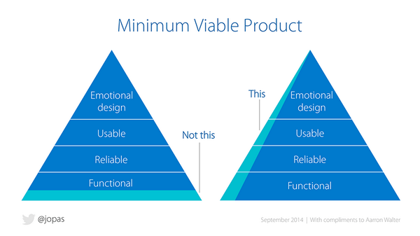



# Objectifs

Proposer des outils et des composants d'architecture,
qui devront être à terme utilisés par tous les développeurs.

Les composants seront pensés comme des *produits*, et répondre au concept du *Minimal Viable Product*.



## Partie visible

Ce qui est fourni devra:

- Etre simple d'utilisation.
- S'appuyer sur des standards.
- Versionné, et les versions utilisées devront être maintenues.
- Si possible, être conçu conjointement avec l'infra.
- Fournir des indicateurs sur son utilisation.
- Etre monitorable, lever des alertes.
- Etre documenté (dev et infra).

On traîtera les sujets en Agile, la constitution d'un backlog se fera par les développeurs des équipes projet.

## Partie invisible

Beaucoup plus que l'aspect techniaue, c'est l'aspect *humain* qui va être difficile à traîter.

Les postes d'architecture sont souvent convoités par les développeurs.
Si on donne l'image que les éléments d'architecture leur sont *imposés*, cela engendrera des jalousies, des tensions, bref de la contre-productivité.

Lyra est rempli de personnes brillantes, passionnées, avec des caractères forts. Il faut donc prendre le temps de *convaincre* les gens.

On parle souvent de *conception orientée utilisateur*, et là on est en plein dedans, car *les développeurs sont des utilisateurs* aussi, au même titre que l'équipe infra.

Voici quelques règles de "bonne conduite", ou de posture/attitude à observer:

- Le pôle devra être au service des équipes projets.
- Les architectes intervenant sur les projets seront pilotés par le chef de projet, ou le Scrum master.
- L'écoute est fondamentale, et les idées des autres, qu'elles soient des propositions fonctionnelles ou des suggestions d'outils/produits à utiliser, sont à considérer (j'ajouterai: avec plus d'importance que les siennes).
- Plus que le résultat final, c'est le cheminement qui est important.
Documenter au fur et à mesure les essais et les choix faits.
*Documenter les échecs* qui ont poussé à l'abandon de tel ou tel outil.
- *Ne pas intervenir sur la partie métier*. Cela serait vu comme de l'ingérance, et pousserait à la déresponsabilisation.
- *Ne pas interdire* à des personnes d'une équipe projet de traîter un sujet qui semblerait devoir être pris en charge par le pôle.
Il vaut mieux ne pas proposer de solution, qu'en proposer une mauvaise.
Après coup, quand le sujet est moins d'actualité, donc moins sensible, y revenir avec la "tête froide".

# Ce qu'il ne faut pas (plus) faire

Petit florilège de mauvais choix, ne pas chercher de responsable en dehors de moi-même, pour avoir soit fait ou cautionné, soit laissé faire.

## Premature Optimisation

La citation du Dr Knuth la plus célèbre, et paradoxalement la moins comprise.

Dans la famille "Premature", on trouve aussi Premature Abstraction, Premature Generalization, etc.

Exemple: les tables VadCurTrans / VadRemTrans dans la VAD.

## Interdépendances

Exemples: Le MPI 3-DS, le centre de notifications...

## Ne pas suffisément découper ou itérer

On parle de mettre en commun les authentifications, les autorisations et les notifications.

On parle bien de trois sujets différents, j'espère...

## Adapter le problème à la solution...

...au lieu d'adapter la solution au problème.

Un bon article sur le sujet: [How to Avoid the Innovator’s Bias for the Solution](http://leanstack.com/how-to-uncover-the-right-problems-and-avoid-the-innovators-bias-for-the-solution/)

Exemple: toute l'architecture historique de la VAD. On y fait rentrer au chausse-pied SDD/SCT, marketplace, mPOS.

## S'éloigner des standards

Dernière "sortie de route" en date, "les API REST en mode batch".

1. On crée des API REST d'administration.
2. On décide de créer un format de fichier pour traiter par lots des appels d'API REST.
3. Malheureusement, pour enchainer ces appels à l'API, il faut récupérer des informations à passer entre deux appels consécutifs.
4. Quid de la logique conditionnelle ? De rejeu ?
5. C'est trop compliqué, le client nous fournit un format de fichier plat, et on se débrouille en lui fournissant du code.

Un air de déjà vu ? Pour moi, oui, ce qui nous mène au sujet suivant.

## Ignorer le passé

1. On crée des API SOAP d'administration.
2. C'est trop compliqué, le client nous fournit un format de fichier plat (FAKIR), et on se débrouille.
3. Ca va plus vite d'agir sur les entités directement, plutôt que d'appeler cette API.
4. La moindre modification du format de fichier impose une relivraison de la plateforme VAD.

## Ne jamais jeter de code

Deux citations:

> Measuring programming progress by lines of code is like measuring aircraft building progress by weight. -- *Bill Gates*

> La perfection est atteinte, non pas lorsqu'il n'y a plus rien à  ajouter, mais lorsqu'il n'y a plus rien à retirer. -- *Antoine de Saint-Exupéry*

## Ne pas commenter son code

Avec un peu de mauvaise foi, un exemple: [Fast Inverse Square Root](http://en.wikipedia.org/wiki/Fast_inverse_square_root)
```
float Q_rsqrt( float number )
{
  long i;
  float x2, y;
  const float threehalfs = 1.5F;

  x2 = number * 0.5F;
  y  = number;
  i  = * ( long * ) &y;
  i  = 0x5f3759df - ( i >> 1 );
  y  = * ( float * ) &i;
  y  = y * ( threehalfs - ( x2 * y * y ) );
  // y  = y * ( threehalfs - ( x2 * y * y ) );

  return y;
}
```
